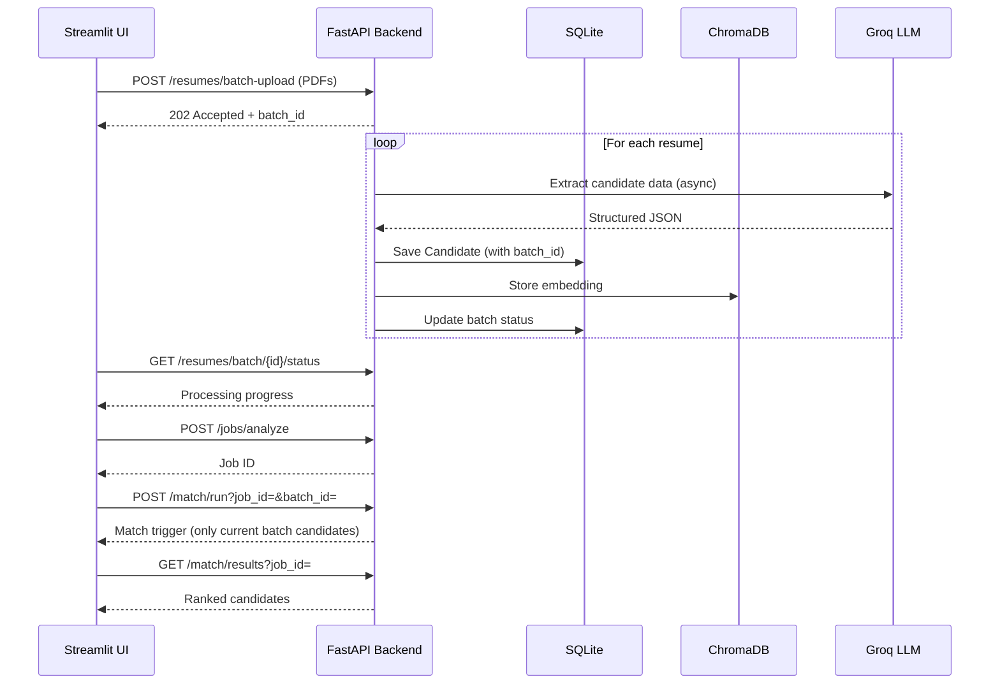

# Resume Analyzer

AI-powered resume screening and candidate ranking system with explainable scoring.

[](https://www.python.org/)
[](https://fastapi.tiangolo.com/)
[](https://opensource.org/licenses/MIT)

## Overview

Resume Analyzer automates the candidate screening process by:
- **Ingesting** PDF resumes in batches
- **Extracting** structured candidate data (skills, experience, contact info) using NLP + LLM
- **Matching** candidates against job descriptions with hybrid scoring
- **Ranking** results with transparent, explainable scores
- **Providing** a web dashboard for recruiters to review matches

## Features

- 📄 **PDF Resume Processing**: Extract text and structured data from PDF files
- 🤖 **LLM-Powered Extraction**: Uses Groq Llama 3.3 70B for accurate candidate data extraction
- 🔍 **Hybrid Matching**: Combines keyword overlap and semantic similarity scoring
- 📊 **Explainable Scores**: Each match includes detailed breakdown of skill matches and experience fit
- ⚡ **Async Processing**: Non-blocking resume processing with progress tracking
- 🎯 **Skill Verification**: Cross-validates extracted skills against source text to prevent hallucination

## Tech Stack

| Layer | Technology |
|-------|------------|
| Runtime | Python 3.13 |
| Web Framework | FastAPI + Uvicorn |
| Frontend | Streamlit |
| PDF Parsing | pdfplumber |
| NLP | spaCy (rule-based) + sentence-transformers |
| LLM Provider | Groq API (Llama 3.3 70B) |
| Database | SQLite (aiosqlite) + ChromaDB |
| Background Tasks | Celery + Redis (or asyncio fallback) |
| Validation | Pydantic v2 |

## Quick Start

### Prerequisites

- Python 3.13+
- Groq API key
- Redis (optional, for Celery)

### Installation

```bash
# Install dependencies
uv sync

# Install spaCy model
uv run python -m spacy download en_core_web_sm
```

### Configuration

Create `.env` file:

```env
# LLM API
GROQ_API_KEY=your_groq_api_key_here
GROQ_MODEL=llama-3.3-70b-versatile

# Database
DATABASE_URL=sqlite+aiosqlite:///./data/resume_analyzer.db

# Vector Store
CHROMA_PERSIST_DIR=./data/chroma_db
CHROMA_COLLECTION_NAME=resume_embeddings

# Embedding Model
EMBEDDING_MODEL=all-MiniLM-L6-v2

# Concurrency
MAX_CONCURRENT_LLM_CALLS=5
USE_CELERY=false
REDIS_URL=redis://localhost:6379/0

# Scoring Weights
WEIGHT_KEYWORD_SCORE=0.4
WEIGHT_SEMANTIC_SCORE=0.4
WEIGHT_EXPERIENCE_SCORE=0.2
```

### Running the Application

```bash
# Start API server
uv run uvicorn src.main:app --reload --port 8000

# Start Streamlit UI (separate terminal)
uv run streamlit run src/ui/app.py --server.port 8501
```

### API Endpoints

| Endpoint | Method | Description |
|----------|--------|-------------|
| `/health` | GET | Health check |
| `/resumes/batch-upload` | POST | Upload PDF resumes (async) |
| `/resumes/batch/{batch_id}/status` | GET | Check batch processing status |
| `/resumes/candidates/{candidate_id}` | GET | Get individual candidate details |
| `/jobs/analyze` | POST | Submit job description (title & description required) |
| `/match/run?job_id=...&batch_id=...` | POST | Run candidate matching (batch_id optional) |
| `/match/results?job_id=...` | GET | Get ranked match results |

### Testing

```bash
# Run tests
uv run pytest tests/ -v

# Linting
uv run ruff check src/
```

## Architecture

```
src/
├── main.py                 # FastAPI app instance
├── pipeline.py             # Orchestration layer
├── core/
│   ├── schemas.py          # Pydantic models
│   ├── config.py           # Settings management
│   └── exceptions.py       # Custom exceptions
├── api/
│   ├── resumes.py          # Resume endpoints
│   ├── jobs.py             # Job endpoints
│   └── matching.py         # Matching endpoints
├── ingestion/
│   └── pdf_extractor.py    # PDF text extraction
├── extraction/
│   ├── rule_base.py        # Regex-based extraction
│   └── llm_extractor.py    # LLM extraction with retry
├── jobspec/
│   └── jd_analyzer.py      # Job description parsing
├── matching/
│   ├── keyword_matcher.py  # Skill overlap scoring
│   └── semantic_matcher.py # Embedding similarity
├── ranking/
│   └── scorer.py           # Score combination
└── storage/
    ├── db.py               # SQLite repository
    └── vector_store.py     # ChromaDB wrapper
```

## Scoring Methodology

The final match score combines three components:

```
final_score = 0.4 × keyword_score + 0.4 × semantic_similarity + 0.2 × experience_match_score
```

| Component | Weight | Calculation |
|-----------|--------|-------------|
| Keyword Score | 40% | Matched required skills / Total required skills |
| Semantic Similarity | 40% | Cosine similarity of embeddings |
| Experience Match | 20% | Candidate years / Required years (capped at 1.0) |

Each match result includes a human-readable explanation explaining the skill matches and experience fit.

[See docs/scoring_methodology.md](docs/scoring_methodology.md) for detailed documentation.

## Database Design

- **SQLite**: Stores candidates, jobs, match results, and batch metadata
- **ChromaDB**: Stores candidate embeddings for semantic similarity search
- **Batch Processing**: Resumes are processed asynchronously; status tracked via batch IDs

[See docs/database_design.md](docs/database_design.md) for complete schema documentation.

## API Usage Flow



**Note**: The `batch_id` parameter in `/match/run` ensures only candidates from the current upload batch are matched against the job. Without it, all stored candidates would be matched.

## Development

### Project Structure

```bash
# Run linting
uv run ruff check src/

# Run type checking
uv run mypy src/

# Run tests with coverage
uv run pytest tests/ --cov=src
```

### Adding New Skills

Edit `src/extraction/rule_base.py` to add skills to the `COMMON_SKILLS` set:

```python
COMMON_SKILLS = {
    "python", "fastapi", "sql", # ...
}
```

## License

MIT License